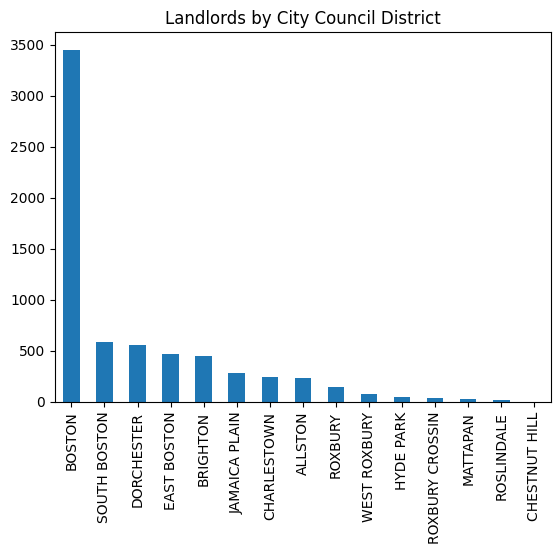
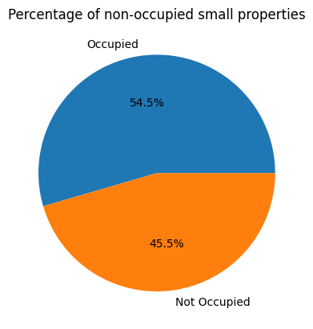
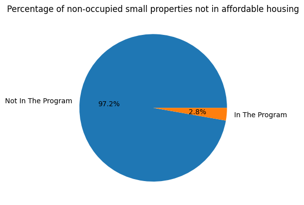

# Deliverable 2

## CS 506 City Council - Councilor Louijeune Small Landlord Project

### Dominic Maglione, Daniel Melchor, Anderson Xia

---

## Status Report

As of this deliverable we have answered four base questions as directed by our PM. No notable modifications/changes have been made to the dataset. However, we utilized the [Google Places API](https://developers.google.com/maps/documentation/places/web-service/overview) to try and mitigate the data limitations described in [`deliverable-1.md`](./deliverable-1.md).

## 4 Base Questions

Please note, the code for all questions answered below can be found in ['3_questions.ipynb'](../src/3_questions.ipynb).

### What is the current distribution of landlords not currently enrolled in different affordable housing programs?

We examined the data to answer three sub-questions.

**Total number of units in non-affordable housing?**

By briefly parsing the data, we were able to determine there are approximately `433,691` units in non-affordable housing. Of course this number may be subject to error based on what methods we employed to arrive at it. However, we believe it is close enough to be considered accurate.

**Geographic distribution of non-affordable units by zip code?**

Below is a chart that conveys this data. Some numbers may overlap because we decided to not omit any zip codes within the data set.

[`3_questions.ipynb`](../src/3_questions.ipynb)

Below is a table specifying the four zip codes that hold in total over 35 percent of non-affordable housing units.

| ZIP CODE | PERCENTAGE | SPECIFIC LOCATION |
| -------- | ---------- | ----------------- |
| 02130 | 9.8% | Jamaica Plain |
| 02135 | 9.8% | Brighton |
| 02214 | 7.9% | West End |
| 02218 | 7.8% | South End |

We did not find it surprising that a bulk of non-affordable units in Brighton, West End, or South End. However, we did not expect many of the units to be in Jamaica Plain. Due to the nature of these areas, there certainly may be not much affordable housing to find room for. Although, we do believe that some of the zip codes with a percentage closer to 3% could be locations worth looking into.

**Demographic Profile of Census Block Groups?**

Below is a chart that displays (by race) which group makes up non-affordable housing units within the data set. We used the census data set to make this analysis.

Please note, we only plotted the most prevalent groups from our available census data. As such, the actual percentages per group are lower than displayed above.

From the chart, we can observe that demographically speaking, a wide majority of non-affordable housing units are occupied by individuals who identify as white on the census. We must note, there is still a majority if we factor in the actual percentage may be quite a bit lower as the chart, once again, only displays the most prevalent groups. Of course, this would make the percentages of those who identify as black and hispanic lower as well.

What surprised us, is going on university data around Boston, we expected those who identify as asian to be a bit more prevalent within Boston. However, this could simply be because the vast majority are students, and not permanent residents of the city.

### What is the breakdown of landlords (in percent) listed under current affordable housing programs?

We analyzed the data to determine which landlords provide the most (quantity) affordable housing as listed by our overlaid dataset. Below is a table containing our results accompanied by a pie chart to display the breakdown by percentage.

Please note, only the top 10 landlords are displayed to avoid clutter. The process was completed in the following file.

[`3_questions.ipynb`](../src/3_questions.ipynb)

Below is a table containing specific numerical data.

| LANDLORD                            | NUMBER OF UNITS |
| ----------------------------------- | --------------- |
| Trustees of Boston College          | 185             |
| Buckminster Hotel Corp              | 132             |
| City of Boston                      | 109             |
| 121 Portland LLC                    | 37              |
| 420 West Broadway Condominium Trust | 36              |
| Fenway Apartments LLC Mass LLC      | 32              |
| Putnam 234 Associates LLC Mass LLC  | 20              |
| Mass Bay Transportation Auth        | 15              |
| Charlestown Properties LLC          | 14              |
| City of Boston By FCL               | 13              |

From the data, we can observe the top 3 landlords that provide affordable housing are the Trustees of Boston College, Buckminster Hotel Corp, and City of Boston. Interestingly, the Trustees of Boston College are listed as providing the largest quantity of affordable housing units.

Since this particular landlord is a university, it could be argued these units are specifically for the use of students, and therefore would not assist in our project goal.

This analysis provides us a new question. What units listed under "Affordable Housing" are really intended for the general market, or specifically reserved for certain groups of individuals?

### What is the geographic distribution of these landlords by city council district?

We analyzed the data to determine the quantity of landlords by city council district as listed by our overlaid dataset. Below is a table containing our results accompanied by a bar chart to display the breakdown by quantity.

Unlike the prior question, there was no limit placed on the quantity of districts displayed, as that quantity is already defined. The process was completed in the following file.

[`3_questions.ipynb`](../src/3_questions.ipynb)

| CITY COUNCIL DISTRICT | NUMBER OF LANDLORDS |
| --------------------- | ------------------- |
| Boston                | 3451                |
| South Boston          | 582                 |
| Dorchester            | 555                 |
| East Boston           | 473                 |
| Brighton              | 444                 |
| Jamaica Plain         | 279                 |
| Charlestown           | 245                 |
| Allston               | 237                 |
| Roxbury               | 144                 |
| West Roxbury          | 81                  |
| Hyde Park             | 45                  |
| Roxbury Crossing      | 36                  |
| Mattapan              | 32                  |
| Roslindale            | 22                  |
| Chestnut Hill         | 2                   |

From the data we can observe Boston clearly contains the most landlords that offer affordable housing by a very wide margin.

Interestingly, the largest landlord as observed above is the Trustees of Boston College, yet Chestnut Hill has the lowest number of landlords that offer affordable housing.

This draws into question the impact of each landlord versus the sheer quantity of units they provide. In other words, while Boston has the largest amount of landlords, it doesn't have the largest landlords to impact ratio. It could be very beneficial to our goal to potentially determine and plot this ratio.

### What percentage of housing stock is owned by owner occupied and small landlords, and at what percent affordable?

Please note, we will be using the following definitions in our analysis for small and affordable.

- **Small**: 10 Units or Less
- **Affordable**: In the Income-Restricted Housing Data Set

We analyzed the data using the parameters defined above. We omitted any housing that had zero units, as we felt it would be unnecessary for our analysis. Below are a few pie charts to display our findings.

[`3_questions.ipynb`](../src/3_questions.ipynb)

| FIGURE 1 | FIGURE 2 |
| ----- | ----- |
|  |  |

These initial findings did not surprise us very much. A slight majority of properties are on the larger end, and of the smaller ones about half are occupied. At first glance, half of the smaller properties being unoccupied may not seem that unusual. However, what we found most interesting is in regards to just how many of these unoccupied properties are not listed in the affordable housing data set.

The vast majority of unoccupied smaller properties are not listed in the data set. With about 2% of units being listed. This is certainly worth examining as we achieved this result with approximately 57k rows of data. Naturally, there is some margin of error. For all we know there could have been discrepancies in naming between data sets skewing our results. Regardless, this conveys how such a large number of potentially affordable housing is not properly being recorded and utilized.
