# Deliverable 4

## CS 506 City Council - Councilor Louijeune Small Landlord Project

### Dominic Maglione, Daniel Melchor, Anderson Xia

---

## Abstract

Finding affordable housing is a major challenge for many people, especially in large cities. Councilor Ruthzee is fighting for improved funding and teacher diversity at our schools, and using all the tools at the city’s disposal to address racial justice and equity. One of her proposed solutions is to create a database of affordable housing units available to tenants qualified for affordable rental housing. This report will examine the feasibility of such a database, including the potential benefits, challenges, and questions posed by it's creation. Data science techniques will be used to analyze available data on housing costs and availability, as well as data on the demographics of people who are struggling to find affordable housing. The results of this analysis will be used to make recommendations about whether or not such a database would be effective in helping people find affordable housing.

## Introduction

A database of affordable housing units has the potential to help many people in large cities who are struggling to find affordable housing. This report uses data science techniques to analyze available data on housing costs and availability, as well as data on the demographics of people who are struggling to find affordable housing.

The results of this analysis will be used to make recommendations about whether or not such a database would be effective in helping people find affordable housing.

## Dataset Descriptions

This section describes the project datasets in detail. It explores the various attributes within the dataset, their relationships, and data limitations as well.

### Boston Affordable Housing Stock Data

[SOURCE](https://www.bostonplans.org/housing/finding-housing/property-listings)

The dataset includes information on housing units in Boston that are available for sale or rent. The units are listed by type, address, price, and number of bedrooms. The dataset also includes information on the property owner, the listing agent, and the date the listing was created.

The dataset is limited to housing units that are available for sale or rent in Boston. It does not include information on units that are not available, or on units that are not for sale or rent.

### Income Restricted Properties in Boston

[SOURCE](https://data.boston.gov/dataset/income-restricted-housing/resource/464bd32f-ebac-49e4-884a-01c4549d3cd3)

This dataset includes income-restricted housing in Boston. The data includes the project name, neighborhood, type of housing, number of units, and other pieces of less important data. The data is limited to housing that is income-restricted, so it does not include all housing in Boston.

### Property Assessment FY2022

[SOURCE](https://data.boston.gov/dataset/property-assessment/resource/4b99718b-d064-471b-9b24-517ae5effecc)

The dataset includes information on property assessment in Boston, MA. The data includes the property ID, location, assessment value, assessment year, and assessment type. The data is limited to properties in Boston, MA.

### Boston 2020 Census Data

These datasets contain information about the 2020 census for Boston. The attributes include the census tract number, the total population, the total number of housing units, the total number of occupied housing units, the total number of vacant housing units, the total number of households, the median household income, the median housing value, and the median rent. The relationships between the attributes are that the total population is related to the total number of housing units, the total number of occupied housing units, the total number of vacant housing units, and the total number of households. The median household income is related to the median housing value and the median rent. The data limitations are that it does not include information about the demographics of the population, and it only includes data for Boston.

Boston Voting District Data

[SOURCE](https://data.boston.gov/dataset/2020-census-for-boston/resource/eb072e51-3c72-4524-9fc9-6b377b613bda)

Boston Neighborhood Data

[SOURCE](https://data.boston.gov/dataset/2020-census-for-boston/resource/5800a0a2-6acd-41a3-9fe0-1bf7b038750d)

## Methods

Lists the various methods, techniques, and algorithms used to develop the project solution.

## Project Analysis

It seems that the feasibility of such a database will be based on the data collected and analyzed. The data collected should include information on housing costs and availability, as well as data on the demographics of people who are struggling to find affordable housing. The results of the data analysis should be used to make recommendations about whether or not such a database would be effective in helping people find affordable housing.

The below questions were answered throughout our analysis to narrow down our goal of a housing affordability dataset and it's feasability.

### What is the current distribution of landlords not currently enrolled in different affordable housing programs?

We examined the data to answer three sub-questions.

**Total number of units in non-affordable housing?**

By briefly parsing the data, we were able to determine there are approximately `433,691` units in non-affordable housing. Of course this number may be subject to error based on what methods we employed to arrive at it. However, we believe it is close enough to be considered accurate.

**Geographic distribution of non-affordable units by zip code?**

Below is a chart that conveys this data. Some numbers may overlap because we decided to not omit any zip codes within the data set.

[`3_questions.ipynb`](../src/3_questions.ipynb)

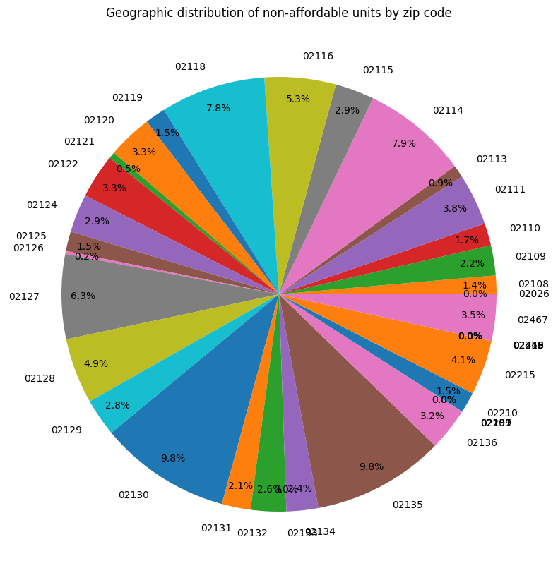

Below is a table specifying the four zip codes that hold in total over 35 percent of non-affordable housing units.

| ZIP CODE | PERCENTAGE | SPECIFIC LOCATION |
| -------- | ---------- | ----------------- |
| 02130 | 9.8% | Jamaica Plain |
| 02135 | 9.8% | Brighton |
| 02214 | 7.9% | West End |
| 02218 | 7.8% | South End |

We did not find it surprising that a bulk of non-affordable units in Brighton, West End, or South End. However, we did not expect many of the units to be in Jamaica Plain. Due to the nature of these areas, there certainly may be not much affordable housing to find room for. Although, we do believe that some of the zip codes with a percentage closer to 3% could be locations worth looking into.

**Demographic Profile of Census Block Groups?**

Below is a chart that displays (by race) which group makes up non-affordable housing units within the data set. We used the census data set to make this analysis.

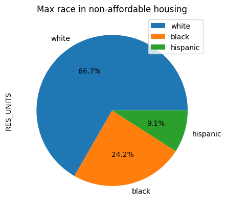

Please note, we only plotted the most prevalent groups from our available census data. As such, the actual percentages per group are lower than displayed above.

From the chart, we can observe that demographically speaking, a wide majority of non-affordable housing units are occupied by individuals who identify as white on the census. We must note, there is still a majority if we factor in the actual percentage may be quite a bit lower as the chart, once again, only displays the most prevalent groups. Of course, this would make the percentages of those who identify as black and hispanic lower as well.

What surprised us, is going on university data around Boston, we expected those who identify as asian to be a bit more prevalent within Boston. However, this could simply be because the vast majority are students, and not permanent residents of the city.

### What is the breakdown of landlords (in percent) listed under current affordable housing programs?

We analyzed the data to determine which landlords provide the most (quantity) affordable housing as listed by our overlaid dataset. Below is a table containing our results accompanied by a pie chart to display the breakdown by percentage.

Please note, only the top 10 landlords are displayed to avoid clutter. The process was completed in the following file.

[`3_questions.ipynb`](../src/3_questions.ipynb)

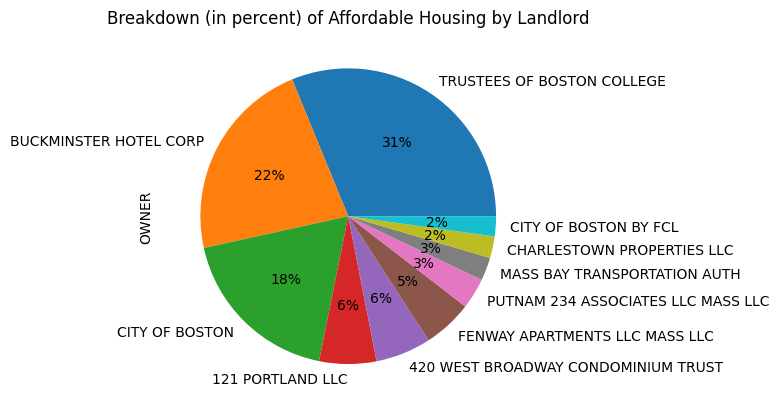

Below is a table containing specific numerical data.

| LANDLORD                            | NUMBER OF UNITS |
| ----------------------------------- | --------------- |
| Trustees of Boston College          | 185             |
| Buckminster Hotel Corp              | 132             |
| City of Boston                      | 109             |
| 121 Portland LLC                    | 37              |
| 420 West Broadway Condominium Trust | 36              |
| Fenway Apartments LLC Mass LLC      | 32              |
| Putnam 234 Associates LLC Mass LLC  | 20              |
| Mass Bay Transportation Auth        | 15              |
| Charlestown Properties LLC          | 14              |
| City of Boston By FCL               | 13              |

From the data, we can observe the top 3 landlords that provide affordable housing are the Trustees of Boston College, Buckminster Hotel Corp, and City of Boston. Interestingly, the Trustees of Boston College are listed as providing the largest quantity of affordable housing units.

Since this particular landlord is a university, it could be argued these units are specifically for the use of students, and therefore would not assist in our project goal.

This analysis provides us a new question. What units listed under "Affordable Housing" are really intended for the general market, or specifically reserved for certain groups of individuals?

### What is the geographic distribution of these landlords by city council district?

We analyzed the data to determine the quantity of landlords by city council district as listed by our overlaid dataset. Below is a table containing our results accompanied by a bar chart to display the breakdown by quantity.

Unlike the prior question, there was no limit placed on the quantity of districts displayed, as that quantity is already defined. The process was completed in the following file.

[`3_questions.ipynb`](../src/3_questions.ipynb)

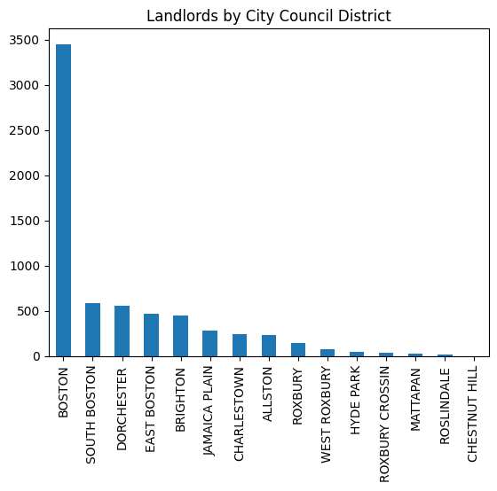

| CITY COUNCIL DISTRICT | NUMBER OF LANDLORDS |
| --------------------- | ------------------- |
| Boston                | 3451                |
| South Boston          | 582                 |
| Dorchester            | 555                 |
| East Boston           | 473                 |
| Brighton              | 444                 |
| Jamaica Plain         | 279                 |
| Charlestown           | 245                 |
| Allston               | 237                 |
| Roxbury               | 144                 |
| West Roxbury          | 81                  |
| Hyde Park             | 45                  |
| Roxbury Crossing      | 36                  |
| Mattapan              | 32                  |
| Roslindale            | 22                  |
| Chestnut Hill         | 2                   |

From the data we can observe Boston clearly contains the most landlords that offer affordable housing by a very wide margin.

Interestingly, the largest landlord as observed above is the Trustees of Boston College, yet Chestnut Hill has the lowest number of landlords that offer affordable housing.

This draws into question the impact of each landlord versus the sheer quantity of units they provide. In other words, while Boston has the largest amount of landlords, it doesn't have the largest landlords to impact ratio. It could be very beneficial to our goal to potentially determine and plot this ratio.

### What percentage of housing stock is owned by owner occupied and small landlords, and at what percent affordable?

Please note, we will be using the following definitions in our analysis for small and affordable.

- **Small**: 10 Units or Less
- **Affordable**: In the Income-Restricted Housing Data Set

We analyzed the data using the parameters defined above. We omitted any housing that had zero units, as we felt it would be unnecessary for our analysis. Below are a few pie charts to display our findings.

[`3_questions.ipynb`](../src/3_questions.ipynb)

| FIGURE 1 | FIGURE 2 |
| ----- | ----- |
| 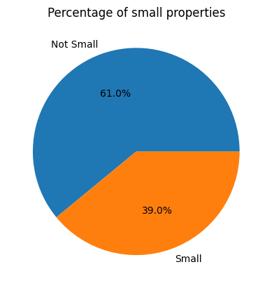 | 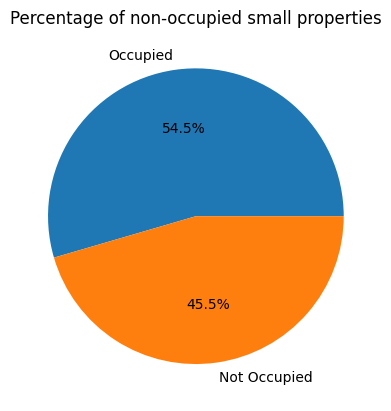 |

These initial findings did not surprise us very much. A slight majority of properties are on the larger end, and of the smaller ones about half are occupied. At first glance, half of the smaller properties being unoccupied may not seem that unusual. However, what we found most interesting is in regards to just how many of these unoccupied properties are not listed in the affordable housing data set.

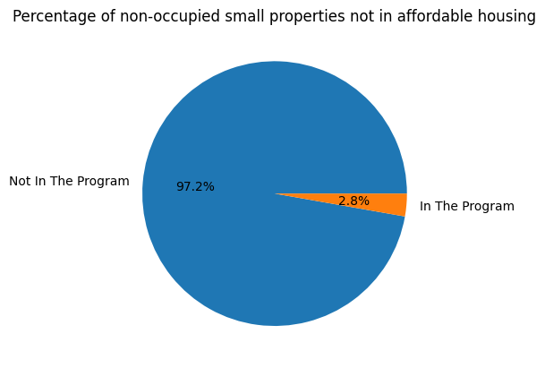

The vast majority of unoccupied smaller properties are not listed in the data set. With about 2% of units being listed. This is certainly worth examining as we achieved this result with approximately 57k rows of data. Naturally, there is some margin of error. For all we know there could have been discrepancies in naming between data sets skewing our results. Regardless, this conveys how such a large number of potentially affordable housing is not properly being recorded and utilized.

## Final Results

Based on the analysis conducted, it is recommended that the city create a database of affordable housing units available to tenants qualified for affordable rental housing. Such a database would be beneficial in helping people find affordable housing, as it would provide a centralized location for people to search for available units. Additionally, the database could be used to track the availability of units over time, and to identify trends in housing costs and availability. There are some challenges that would need to be addressed in order to make the database effective, such as ensuring that it is kept up-to-date and that it includes accurate information on unit availability. However, overall, the benefits of such a database would outweigh the challenges, and it would be an effective tool in helping people find affordable housing

### Extension Project

There are a number of ways to extend this project to match owner name and address to the voter file. One way would be to use a public records search to find the owner's name and address. Another way would be to use a reverse address lookup to find the owner's name and address. Once the owner's name and address have been found, they can be matched to the voter file to see how many are voters for the project.

In the below file we have begun this extension project:

[`3_questions.ipynb`](../src/3_questions.ipynb)

Here are some of the trends we have discovered which may assist the city coucilor's team in recruiting more small rental property owners into their affordable housing program:

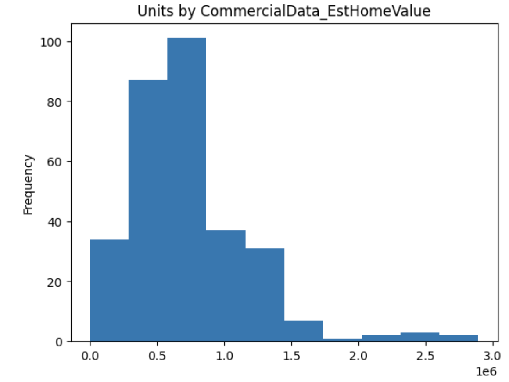

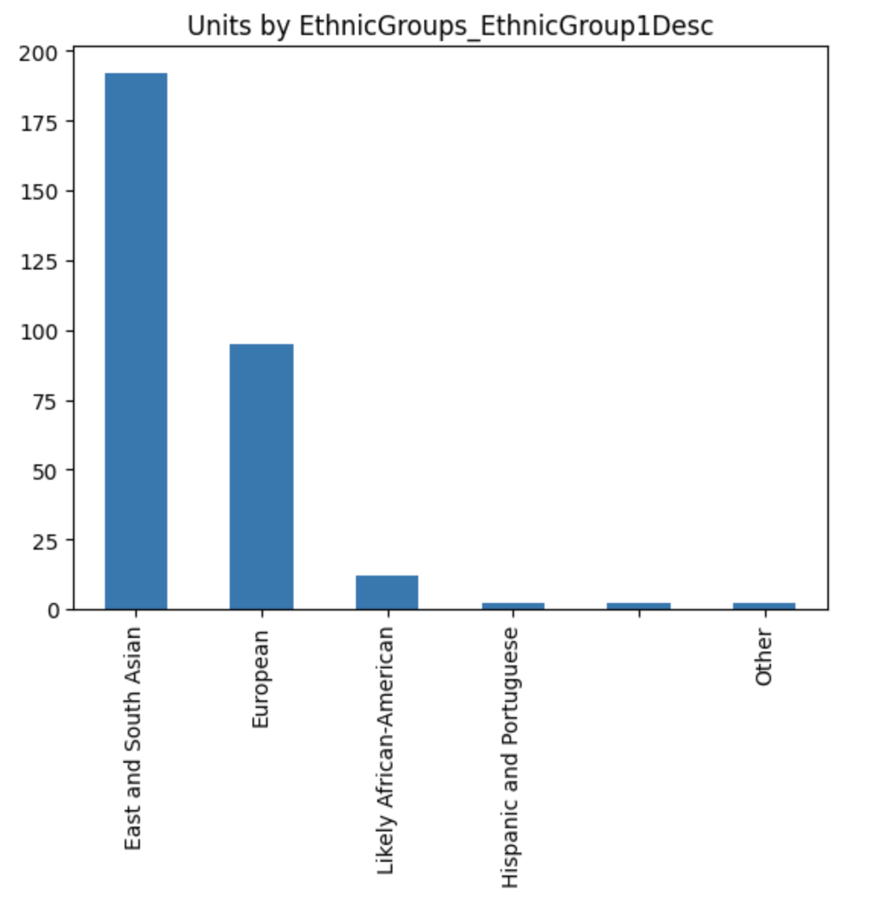
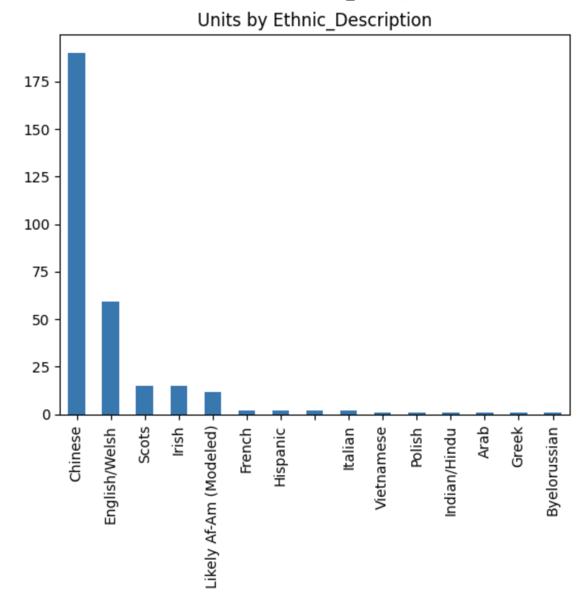
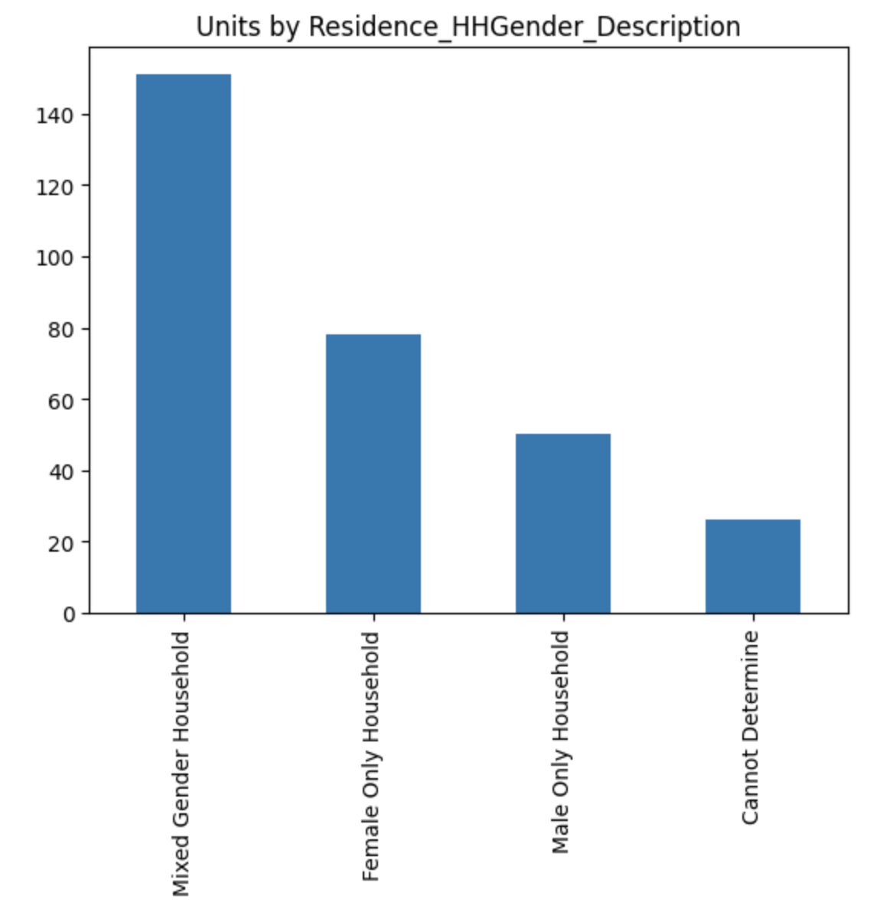
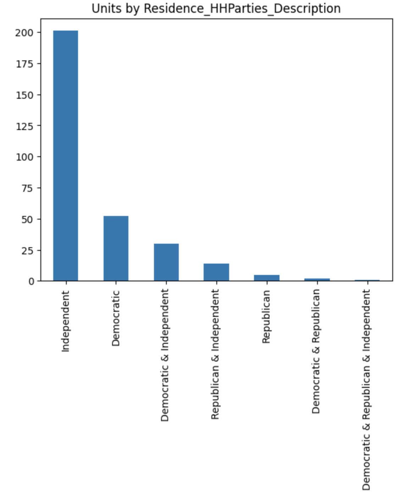
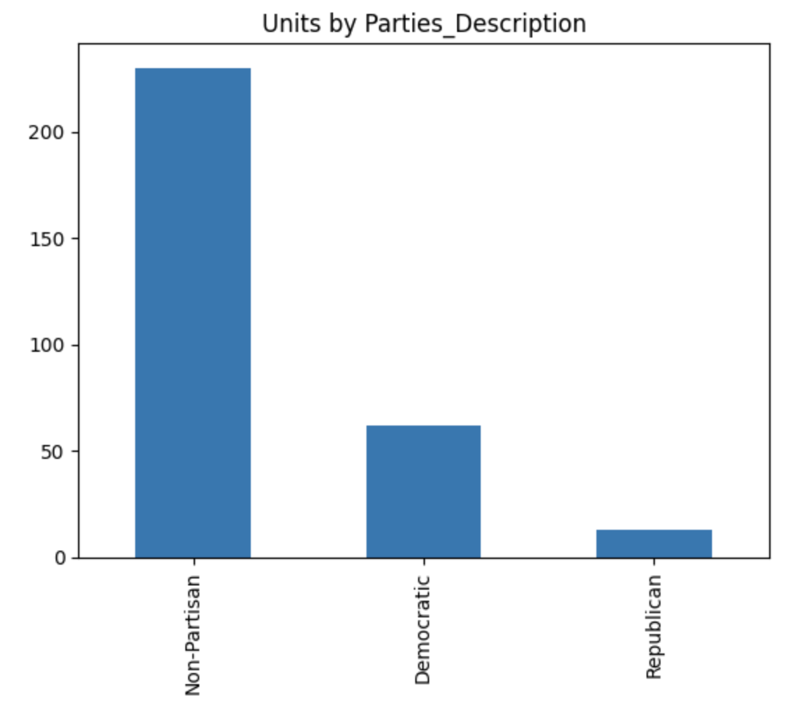

## Conclusion

Based on the data analysis, it is clear that there is a need for a database of affordable housing units. Such a database would be beneficial in helping people find affordable housing. However, there are some challenges that need to be considered when creating such a database. First, it is important to ensure that the data is accurate and up-to-date. Second, the database should be easy to use and accessible to those who need it. Third, the database should be designed to protect the privacy of those who use it.

Overall, a database of affordable housing units would be a valuable tool in helping people find affordable housing. However, care must be taken to ensure that the data is accurate and up-to-date, and that the database is easy to use and accessible to those who need it.

### Future Scope

Below are a few ideas we had for future project ideas that could be developed through the proposed housing dataset.

- Develop a model to predict the likelihood of housing units becoming available in the future, based on factors such as vacancy rates, turnover rates, and seasonality.

- Use machine learning techniques to cluster housing units by price, location, and other features, in order to help people find units that meet their needs.

- Use data from the database to identify patterns in housing affordability, and make recommendations for policy changes that could help improve the situation.

- Evaluate the effectiveness of the database in helping people find affordable housing, and make recommendations for how it could be improved.

## References

- [Google Places API](https://developers.google.com/maps/documentation/places/web-service/overview)
- [Boston Census Data](https://www.census.gov/quickfacts/bostoncitymassachusetts)
- [MA Voter File (BU Email to Access)](https://drive.google.com/drive/u/1/folders/1DyCevtTWTMMNrZXsCycLGiSA_uc6lq8r)
- [Boston Electoral Maps](https://www.bostonplans.org/3d-data-maps/gis-maps/electoral-maps)
- [mapbox - Category Search](https://docs.mapbox.com/api/search/CategorySearch/)

### Details and Usage

**Google Places API:**

- Allows developers to access a wealth of information about businesses and landmarks in an area
- Can be used to find contact information, hours of operation, reviews, and more

**Boston Census Data:**

- Provides detailed information about the population of Boston, including demographics, income, housing, education, and more

**MA Voter File:**

- Contains detailed information about registered voters in Massachusetts
- Can be used to find contact information, voting history, and more

**Boston Electoral Maps:**

- Contains maps of Boston's electoral wards and precincts
- Can be used to find election results and more
