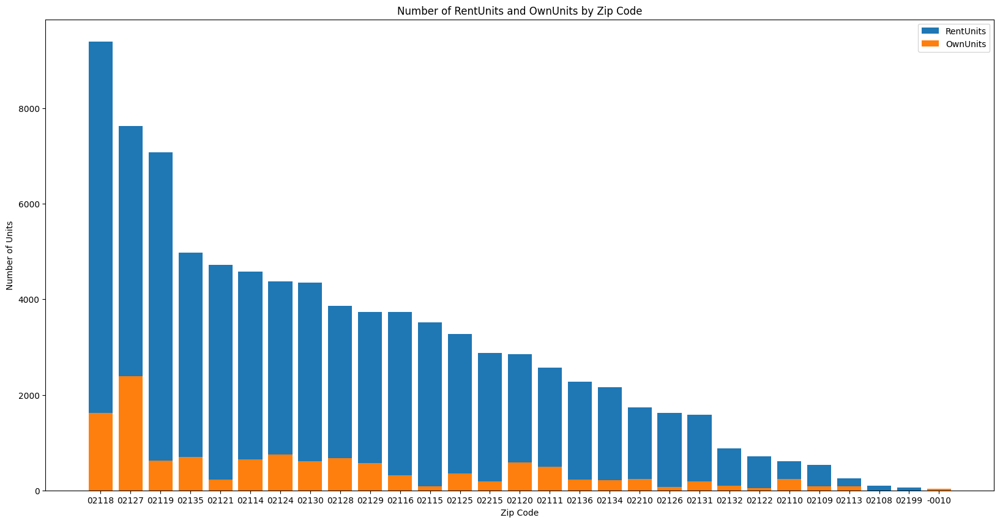

# Deliverable 1

## Questions:

### 1. What percentage of housing stock is owned by owner occupied landlords?

```
Number of owner occupied housing: 78242
Percentage of owner occupied housing: 0.4380900122061837
```

According to our preliminary analysis of the data, 43.8% of housing stock is owned by owner occupied landlords.

### 2. What is the current distribution of landlords and housing listed in current affordable housing programs?

#### Number of Units

```
Number of affordable housing units: 73665
Percentage of affordable housing units of all non-owner residential housing units: 0.6286750586729251
Percentage of affordable housing units of all residential housing units: 0.48588163128005224
```

Through our analysis, we have determined that 73665 total affordable units exist.

Out of these units, 62% of affordable housing units are non-owner residential housing units, and 48% of affordable housing units are residential housing units.

#### Geographic Distribution (by zip code)



We have used -0010 as a means of grouping together affordable housing that does not have a listed zip code. This is a small number of units.

As we can observe, the three zipcodes with the highest number of affordable housing units are 02118, 02127, 02119, 02135, 02121.

Interestingly, the highest ratio of own/rent units is to 02127.

## Risks and Limitations

The biggest limitation with this project is the data that is available to us. In our exploration, we found that the affordable housing data does not include any addresses. We had to make our best guess based upon the project name and zip code and utilized the Google Places API to find a matching address.

Tom Hopper, who is part of Spark! support for this project is aiding us in getting access to potentially better data. This should allow us to provide more accurate analysis.

## Refined Project Scope

We have decided to focus on the following questions:
1. What is the current distribution of landlords NOT currently enrolled in different affordable housing units?
    - Number of units
    - Geographic distribution
2. What percentage of owner occupied and small landlord housing stock is affordable?
