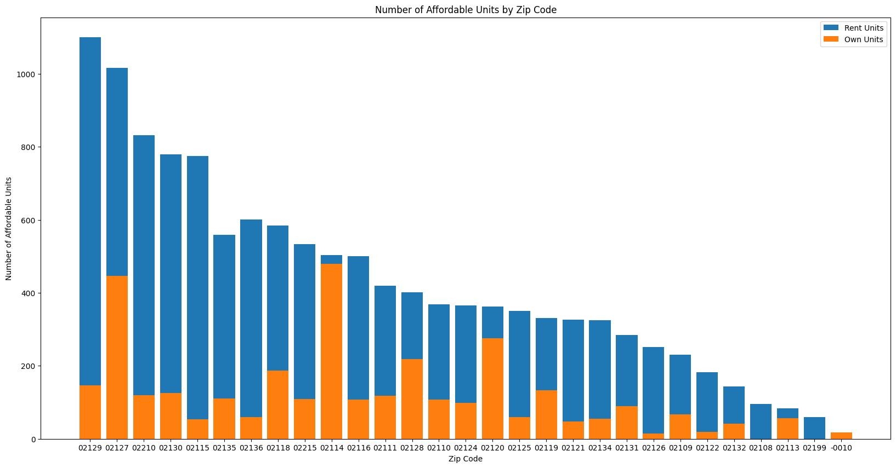

# Deliverable 0


## Questions:

1. What is the current distribution of landlords NOT currently enrolled in
different affordable housing units?

number of units

Grouped by geographic distribution (by zip code)

2. What is the current distribution of landlords and housing listed in current
affordable housing programs?

Number of Units

```
Number of affordable housing units: 73665
Percentage of affordable housing units of all non-owner residential housing units: 0.6286750586729251
Percentage of affordable housing units of all residential housing units: 0.48588163128005224
```

Through our analysis, we have determined that 73665 total affordable units exist.

Out of these units, 62% of affordable housing units are non-owner residential
housing units, and 48% of affordable housing units are residential housing units.

---

Geographic Distribution (by zip code)



We have used -0010 as a means of grouping together affordable housing that does
not have a listed zip code. This is a small number of units.

As we can observe, the three zipcodes with the highest number of affordable
housing units are 02129, 02127, 02210, 02130, 02115. These correspond to
Charlestown, South Boston, Seaport, Jamaica Plain, and South/East Fenway.

Interestingly, the highest ratio of rent/own units is to 02114, which is the
West End.